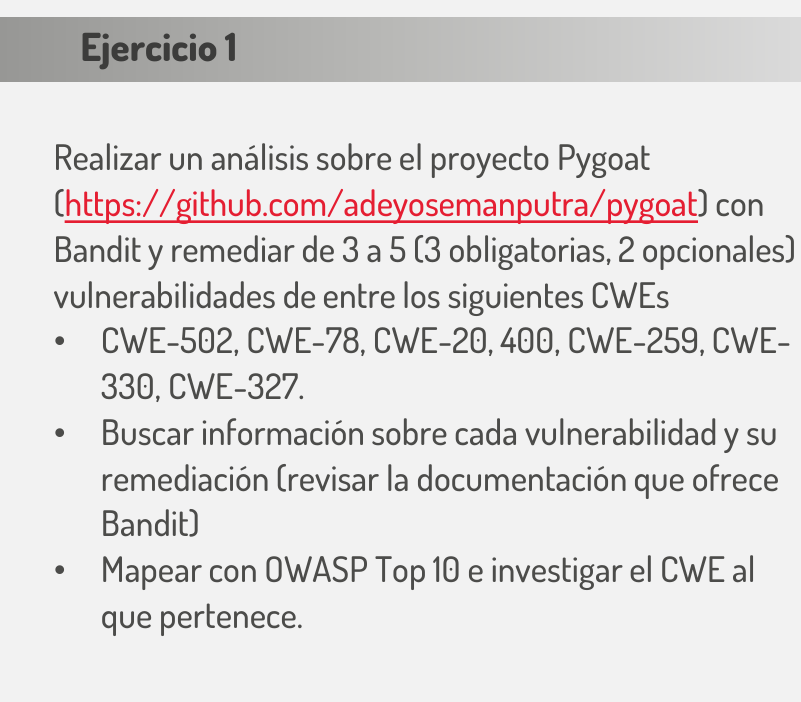

# Ejercicio 1

- [ ] Realizar un análisis sobre el proyecto pygoat con Bandit
- [ ] Remediar 3 a 5 vulnerabilidades
- [ ] Buscar información sobre cada vulnerabilidad y su remediación 
- [ ] Mapear con OWASP Top 10 e investigar el CWE al que pertenece

1. Preparar jenkins (ver "Pasos para instalar y ejecutar jenkins en docker")

2. Se crea un Item llamado "ejercicio1" de tipo pipeline

3. 
