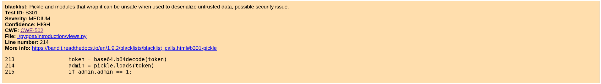
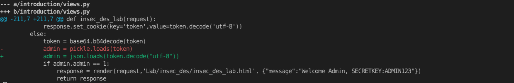
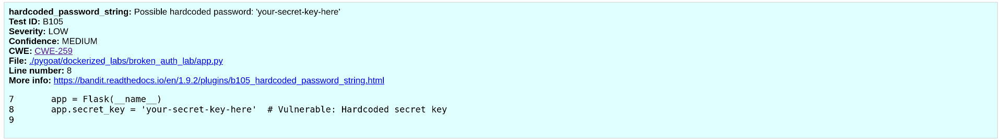
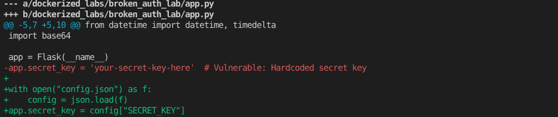
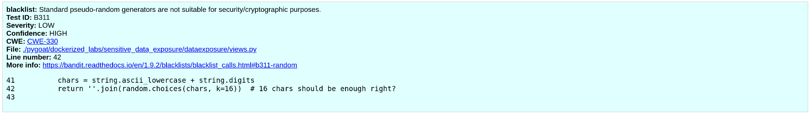
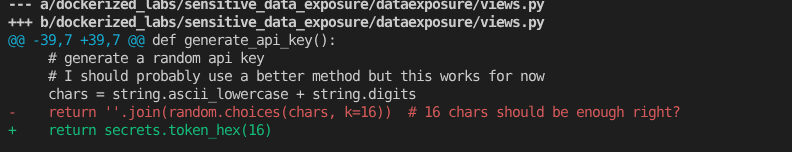

# 1. Ejercicio 1


## 1.1. Clonamos el repositorio pygoat
```bash
git clone https://github.com/adeyosemanputra/pygoat
```


## 1.2. Configuramos el entorno e instalamos bandit:
```bash
python -m venv .venv
source .venv/bin/activate
pip install bandit
```


## 1.3. Ejecutamos el analisis exportando el resultado a txt, json y html
```bash
mkdir bandit_reports
bandit -r ./pygoat -f html -o bandit_reports/bandit_report.html
bandit -r ./pygoat -f json -o bandit_reports/bandit_report.json
bandit -r ./pygoat -f txt -o bandit_reports/bandit_report.txt
```


## 1.4. Verificamos el resultado, y seleccionamos las vulnerabilidades a remediar correspondientes a los CWEs requeridos por el ejercicio:

### 1.4.1. CWE-327 — Use of a Broken or Risky Cryptographic Algorithm


#### 1.4.1.1. Descripción del CWE-327


>El producto utiliza un algoritmo o protocolo criptográfico roto o riesgoso.
>
>Los algoritmos criptográficos son métodos mediante los cuales se codifican los datos para evitar la observación o la influencia de actores no autorizados. La criptografía insegura puede explotarse para exponer información confidencial, modificar datos de forma inesperada, suplantar la identidad de otros usuarios o dispositivos, u otros efectos.
>
>Es muy difícil crear un algoritmo seguro, e incluso algoritmos de alto perfil creados por expertos en criptografía han sido descifrados. Existen técnicas bien conocidas para descifrar o debilitar diversos tipos de criptografía. Por consiguiente, existe un pequeño número de algoritmos bien comprendidos y ampliamente estudiados que deberían ser utilizados por la mayoría de los productos. Usar un algoritmo no estándar o conocido por su inseguridad es peligroso, ya que un adversario decidido podría descifrarlo y comprometer los datos protegidos.
>
>Dado el rápido avance de la criptografía, es común que un algoritmo se considere "inseguro", incluso si en su momento se consideró robusto. Esto puede ocurrir cuando se descubren nuevos ataques o si la potencia de procesamiento aumenta tanto que el algoritmo criptográfico ya no ofrece la protección que se esperaba inicialmente.
>
>Por diversas razones, esta debilidad es aún más difícil de gestionar con la implementación de algoritmos criptográficos en hardware que con la implementación en software. En primer lugar, si se descubre una falla en la criptografía implementada en hardware, en la mayoría de los casos no se puede solucionar sin retirar el producto del mercado, ya que el hardware no es fácilmente reemplazable como el software. En segundo lugar, dado que se espera que el hardware funcione durante años, la potencia de procesamiento del adversario aumentará con el tiempo.

Fuente: https://cwe.mitre.org/data/definitions/327.html

#### 1.4.1.2. Remediación

Se debe utilizar un algoritmo mas robusto para la generación de hash, por lo tanto cambiamos el algoritmo de MD5 a SHA256:


#### 1.4.1.3. Mapeo con OWASP Top 10

El CWE-327, "Uso de un algoritmo criptográfico defectuoso o riesgoso", se relaciona directamente con la categoría **"A04:2025 - Fallos criptográficos"** del Top 10 de OWASP, ya que abarca algoritmos débiles, aleatoriedad insuficiente y criptografía defectuosa que provoca la exposición de datos. 

### 1.4.2. CWE-78 — OS Command Injection


#### 1.4.2.1. Descripción del CWE-78

> El producto construye todo o parte de un comando del sistema operativo utilizando una entrada influenciada externamente desde un componente *upstream*, pero no neutraliza o neutraliza incorrectamente elementos especiales que podrían modificar el comando del sistema operativo deseado cuando se envía a un componente *downstream*.


Fuente: https://cwe.mitre.org/data/definitions/78.html

#### 1.4.2.2. Remediación

Se debe validar el comando introducido o tratarlo, en este caso eliminamos la concatenación de las variables command con domain y en su lugar enviamos a subprocess.Popen un array con los parámetros separados:


#### 1.4.2.3. Mapeo con OWASP Top 10

El CWE-78, "OS Command Injection", se relaciona directamente con la categoría **"A05:2025 - Inyección"**, del Top 10 de OWASP, ya que entra dentro de la definición de Ijection: *Cuando se envían datos no confiables a un intérprete como parte de un comando o consulta.* 

### 1.4.3. CWE-502 Deserialization of Untrusted Data



#### 1.4.3.1. Descripción del CWE-502

> El producto deserializa datos no confiables sin garantizar suficientemente que los datos resultantes sean válidos.

Fuente: https://cwe.mitre.org/data/definitions/502.html

#### 1.4.3.2. Remediación

Se debe utilizar un método de deserialización de datos mas robusto, por lo tanto en lugar de utilizar picke.loads, utilizamos la librería json:



#### 1.4.3.3. Mapeo con OWASP Top 10

El CWE-502 "Deserialización de datos no confiables" se corresponde con OWASP Top 10 **"A08:2025 - Fallas de integridad de software y datos"**, ya que la aplicación deserializa entradas no confiables de una manera que puede permitir violaciones de integridad y ejecución de código arbitrario.

### 1.4.4. CWE-259 Use of Hard-coded Password



#### 1.4.4.1. Descripción del CWE-259

> El producto contiene una contraseña *en duro*, que utiliza para su propia autenticación entrante o para la comunicación saliente con componentes externos.

Fuente: https://cwe.mitre.org/data/definitions/259.html

#### 1.4.4.2. Remediación
Se debe obtener las credenciales desde un gestor de secretos o en todo caso un repositorio de configuraciones.

En este caso, en lugar de tener un valor *en duro* para app.secret_key, lo obtenemos desde un archivo config.json:



#### 1.4.4.3. Mapeo con OWASP Top 10

El CWE-259 "Uso de password en duro" se corresponde con OWASP Top 10 **"A07:2025 - Fallos de autenticación"**, ya que la aplicación integra credenciales estáticas directamente en el código fuente, lo que permite omitir la autenticación y evita la administración y rotación seguras de credenciales.

### 1.4.5. CWE-330 Use of Insufficiently Random Values



#### 1.4.5.1. Descripción del CWE-330

> El producto utiliza números o valores insuficientemente aleatorios en un contexto de seguridad que depende de números impredecibles.

Fuente: https://cwe.mitre.org/data/definitions/330.html

#### 1.4.5.2. Remediación

Se debe utilizar un método mas robusto para generar valores aleatorios.
En este caso, la librería random puede generar valores predecibles, por lo que cambiamos la libreria por secrets:



#### 1.4.5.3. Mapeo con OWASP Top 10

El CWE-330 "Use of Insufficiently Random Values" se corresponde con OWASP Top 10 **"A04:2025 - Fallos criptográficos"** del Top 10 de OWASP, ya que los generadores pseudoaleatorios estándar (como random) no son adecuados para fines de seguridad o criptográficos.