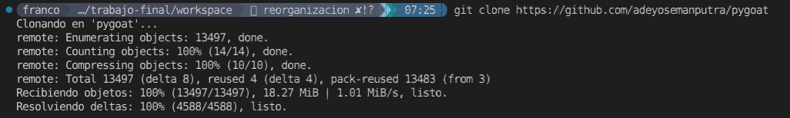
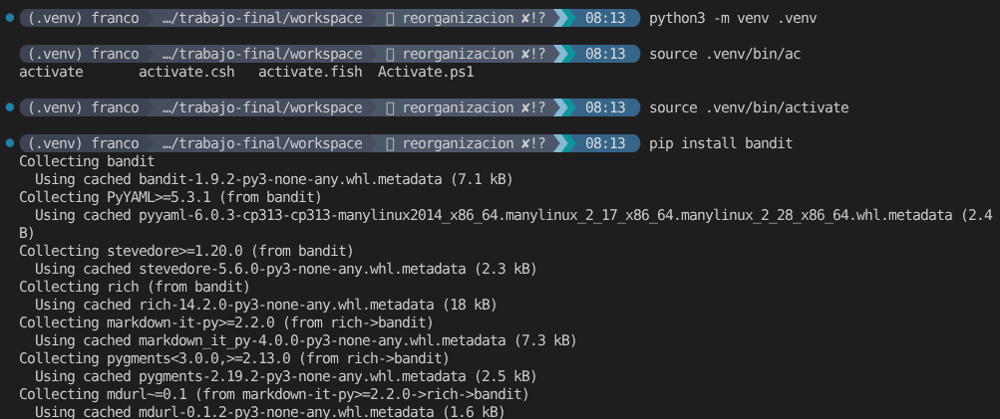
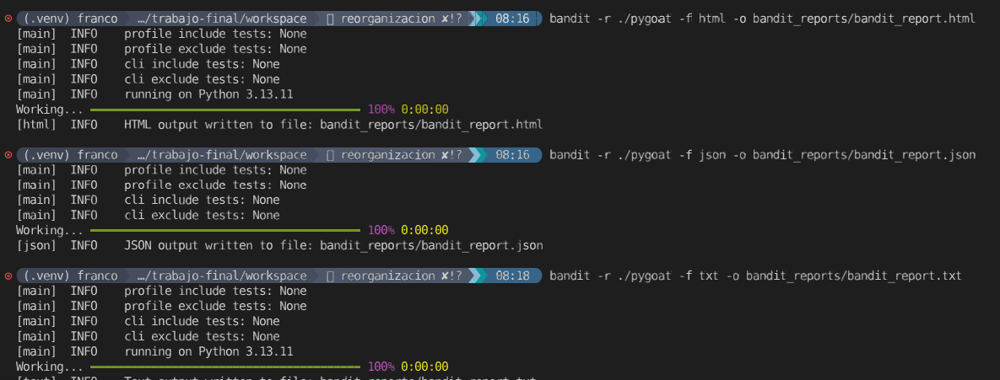
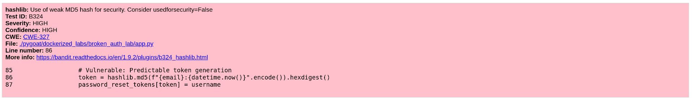
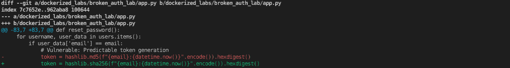
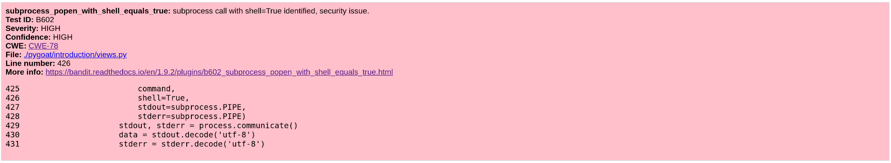
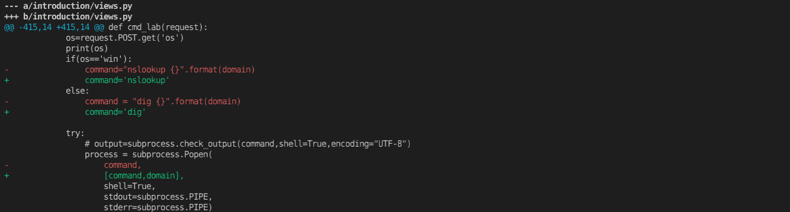

# Ejercicio 1


- [x] Realizar un análisis sobre el proyecto pygoat con Bandit
- [ ] Remediar 3 a 5 vulnerabilidades
- [ ] Buscar información sobre cada vulnerabilidad y su remediación 
- [ ] Mapear con OWASP Top 10 e investigar el CWE al que pertenece

## Análisis de proyecto pygoat con bandit

### 1. Clonamos el repositorio pygoat
```bash
git clone https://github.com/adeyosemanputra/pygoat
```



### 2. Configuramos el entorno e instalamos bandit:
```bash
python -m venv .venv
source .venv/bin/activate
pip install bandit
```



### 3. Ejecutamos el analisis exportando el resultado a txt, json y html
```bash
mkdir bandit_reports
bandit -r ./pygoat -f html -o bandit_reports/bandit_report.html
bandit -r ./pygoat -f json -o bandit_reports/bandit_report.json
bandit -r ./pygoat -f txt -o bandit_reports/bandit_report.txt
```


### 4. Verificamos el resultado, y seleccionamos las vulnerabilidades a remediar correspondientes a los CWEs requeridos por el ejercicio:

#### 4.1. CWE-327 — Algoritmo criptográfico roto o riesgoso



#### 4.1.1. Descripción del CWE-327
```txt
El producto utiliza un algoritmo o protocolo criptográfico roto o riesgoso.

Los algoritmos criptográficos son métodos mediante los cuales se codifican los datos para evitar la observación o la influencia de actores no autorizados. La criptografía insegura puede explotarse para exponer información confidencial, modificar datos de forma inesperada, suplantar la identidad de otros usuarios o dispositivos, u otros efectos.

Es muy difícil crear un algoritmo seguro, e incluso algoritmos de alto perfil creados por expertos en criptografía han sido descifrados. Existen técnicas bien conocidas para descifrar o debilitar diversos tipos de criptografía. Por consiguiente, existe un pequeño número de algoritmos bien comprendidos y ampliamente estudiados que deberían ser utilizados por la mayoría de los productos. Usar un algoritmo no estándar o conocido por su inseguridad es peligroso, ya que un adversario decidido podría descifrarlo y comprometer los datos protegidos.

Dado el rápido avance de la criptografía, es común que un algoritmo se considere "inseguro", incluso si en su momento se consideró robusto. Esto puede ocurrir cuando se descubren nuevos ataques o si la potencia de procesamiento aumenta tanto que el algoritmo criptográfico ya no ofrece la protección que se esperaba inicialmente.

Por diversas razones, esta debilidad es aún más difícil de gestionar con la implementación de algoritmos criptográficos en hardware que con la implementación en software. En primer lugar, si se descubre una falla en la criptografía implementada en hardware, en la mayoría de los casos no se puede solucionar sin retirar el producto del mercado, ya que el hardware no es fácilmente reemplazable como el software. En segundo lugar, dado que se espera que el hardware funcione durante años, la potencia de procesamiento del adversario aumentará con el tiempo.
```

Fuente: https://cwe.mitre.org/data/definitions/327.html

#### 4.1.2. Remediación

Cambiamos el algoritmo para generación de hash de MD5 a SHA256:



#### 4.1.3. Mapeo con OWASP Top 10

El CWE-327, "Uso de un algoritmo criptográfico defectuoso o riesgoso", se relaciona directamente con la categoría A04:2025 - Fallos criptográficos (anteriormente A02 en 2021) del Top 10 de OWASP, ya que abarca algoritmos débiles, aleatoriedad insuficiente y criptografía defectuosa que provoca la exposición de datos. Es una vulnerabilidad clave en esta sección de OWASP.

#### 4.2. CWE-78 — OS Command Injection




#### 4.2.1. Descripción del CWE-78
```txt
El producto construye todo o parte de un comando del sistema operativo utilizando una entrada influenciada externamente desde un componente *upstream*, pero no neutraliza o neutraliza incorrectamente elementos especiales que podrían modificar el comando del sistema operativo deseado cuando se envía a un componente *downstream*.
```

Fuente: https://cwe.mitre.org/data/definitions/78.html

#### 4.2.2. Remediación

Cambiamos el parámetro de shell=True a shell=False:

