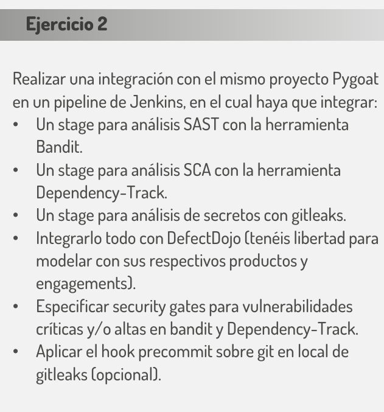
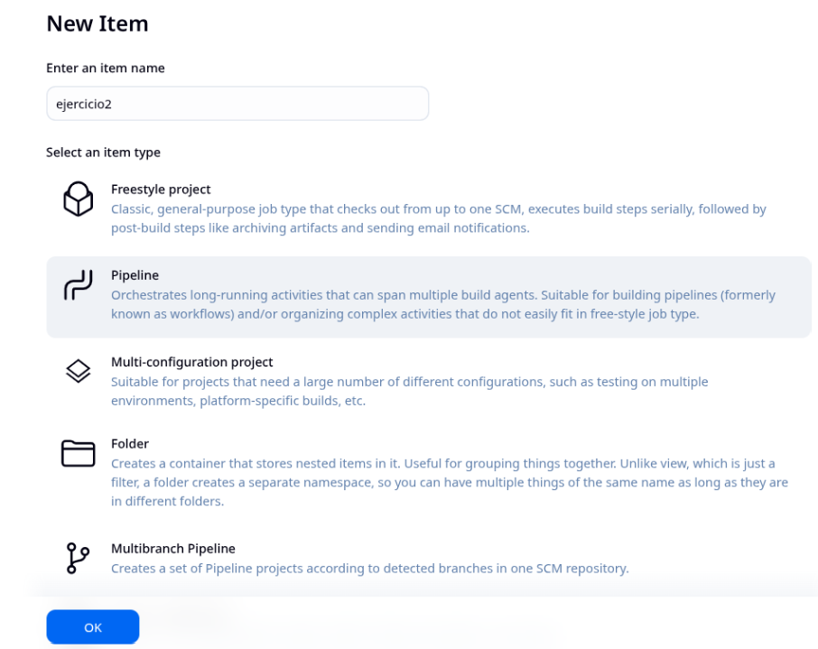
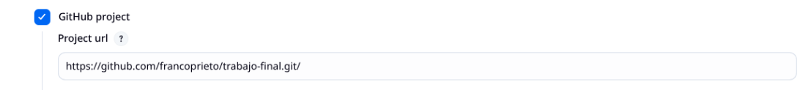
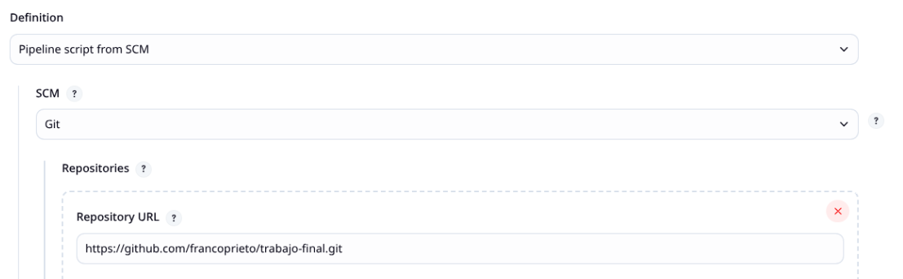
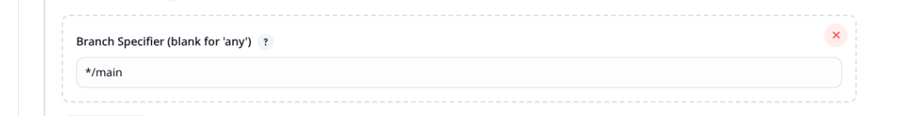
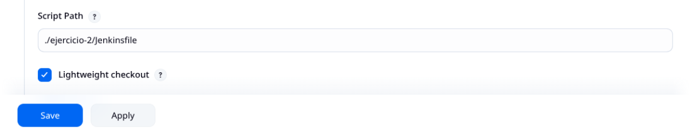

# 2. Ejercicio 2

## 2.1. Montamos una instancia de Jenkins

Seguir los "pasos de para instalar y ejecutar jenkins en docker".

## 2.2. Crear y configurar el pipeline

### 2.2.1. Crear un pipeline

Creamos un Item llamado "ejercicio2" de tipo pipeline.

### 2.2.2. Apuntar a proyecto github
Marcamos la opción "GitHub project" y en "Project url" completamos con:
https://github.com/francoprieto/trabajo-final.git/

### 2.2.3. Apuntar a Jenkinsfile
En la sección  "Definition" seleccionamos la opción "Pipeline script from SCM", y allí completamos con 
- "Repository URL" con https://github.com/francoprieto/trabajo-final.git

- "Branch Specifier (blank for 'any')" completar con: */main

- "Script Path" completar con: ./ejercicio-2/Jenkinsfile

3. Ejecutar el pipeline y verificar el "bandit_report.json" resultante.
