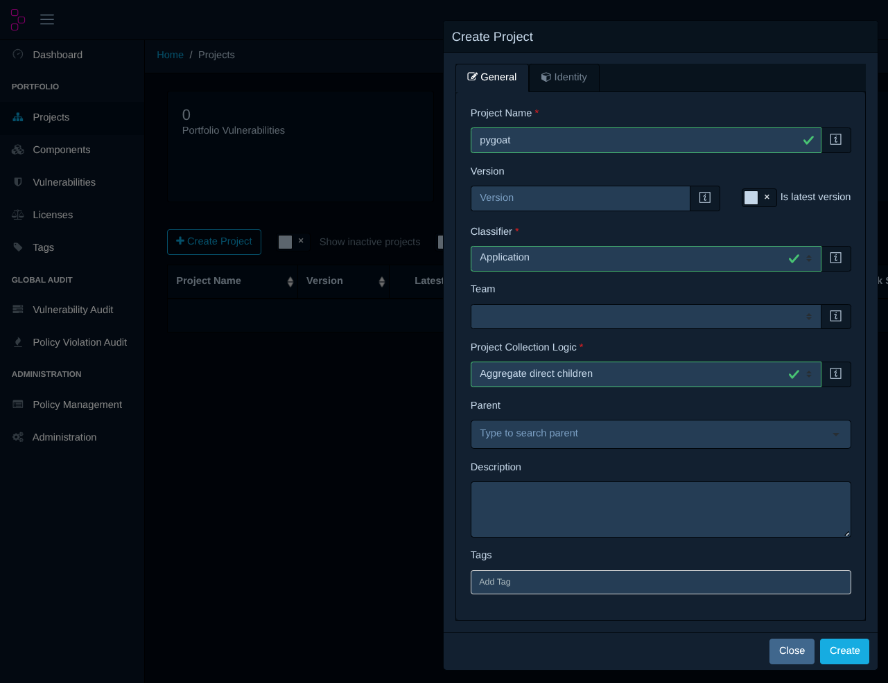
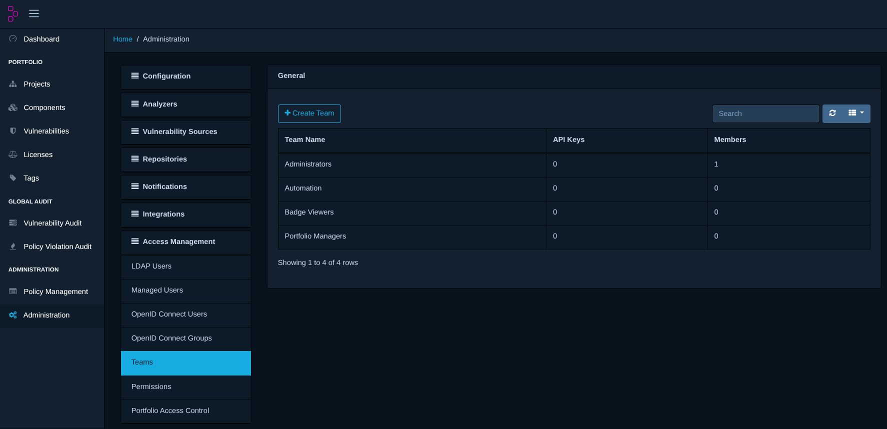
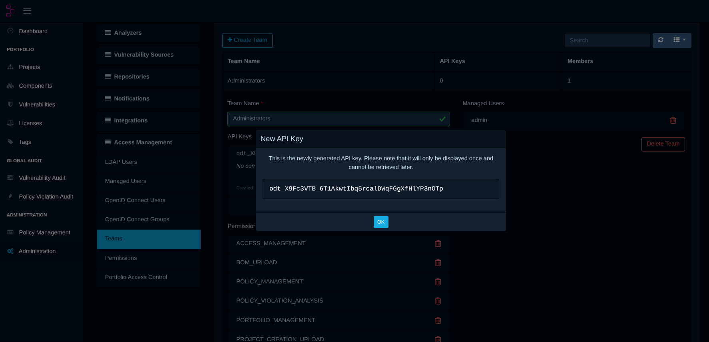
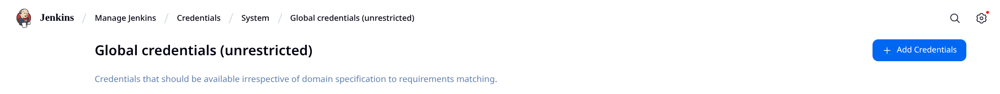
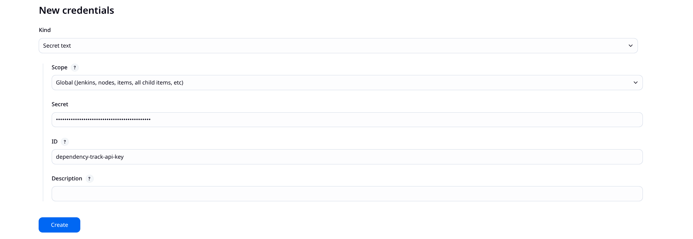
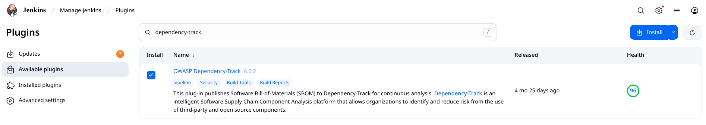

# 2. Ejercicio 2

## 2.1. Montamos las instancias de Jenkins y Dependency-Track

Seguir los [pasos para montar e iniciar los contenedores](../resources/docker/README.md)

## 2.2. Montamos el entorno Dpendency-Track
Seguir los [pasos para montar el entorno dependency-track](../resources/dependency-track/README.md)

### 2.2.1. Configuramos el proyecto *pygoat* en dependency-track

- Ingresamos como admin al Dependency-Track ( http://localhost:8082 )
- Vamos a la opción "Projects", "Create Project +" y completamos los datos de la siguiente manera:

### 2.2.2. Configuramos Api-Key en dependency-track

- Ingresamos a la opción "Administration", "Access Management" y luego "Teams"

- Hacemos click en "Administrators" y luego en el signo "+" de API KEYS, automáticamente se generará una:

***OBS:*** Es muy importante copiar y guardar esta API-KEY

## 2.3. Configuramos las credenciales dependency-track en Jenkins

- Abrimos la opción "Manage Jenkins" (icono del engranage) y luego "Credentials"

- Vamos a "System", "Global Credentials (unrestricted)" y luego "+ Add Credentials"

- El formulario completamos de la siguiente manera:
    - En "Kind" seleccionamos "secret text"
    - En "Secret" completamos con la API-KEY de dependency-track (Paso 2.3)
    - En "ID" completamos con "dependency-track-api-key"
    - Hacemos click en "Create"

## 2.4. Instalamos el plugin dependency-track en Jenkins

- Abrimos la opción "Manage Jenkins" (icono del engranage), "Plugins",  "Available Plugins" y buscamos "dependency-track". Marcamos e Instalamos:

## 2.5. Creamos y configuramos el pipeline

### 2.4.1. Crear un pipeline

Creamos un Item llamado "ejercicio2" de tipo pipeline.

### 2.2.2. Apuntar a proyecto github
Marcamos la opción "GitHub project" y en "Project url" completamos con:
https://github.com/francoprieto/trabajo-final.git/

### 2.2.3. Apuntar a Jenkinsfile
En la sección  "Definition" seleccionamos la opción "Pipeline script from SCM", y allí completamos con 
- "Repository URL" con https://github.com/francoprieto/trabajo-final.git

- "Branch Specifier (blank for 'any')" completar con: */main

- "Script Path" completar con: ./ejercicio-2/Jenkinsfile

3. Ejecutar el pipeline y verificar el "bandit_report.json" resultante.
