# 2. Ejercicio 2

## 2.1. Montamos las instancias de Jenkins y Dependency-Track

Seguir los [pasos para montar e iniciar los contenedores](../resources/docker/README.md)

## 2.2. Configuramos Api-Key en dependency-track

- Ingresamos a dependency-track en  http://localhost:8082 con el Usuario: admin, Password: admin y luego realizamos el proceso de cambio de password por defecto

- Ingresamos a la opción "Administration", "Access Management" y luego "Teams"

- Hacemos click en "Administrators" y luego en el signo "+" de API KEYS, automáticamente se generará una:

> ### ***OBS:*** Es muy importante copiar y guardar esta API-KEY

## 2.3. Obtenemos el API-KEY de Defect Dojo

Ingresamos a Defect Dojo: http://localhost:8083 con las credenciales creadas (ver item 2.1), luego ingresamos al ícono del usuario y luego "API v2 Key"

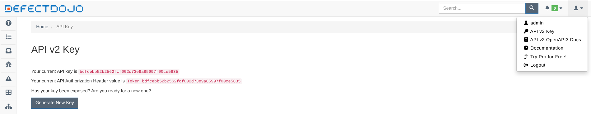

> ### Copiamos el valor correspondiente a: *Your current API key is*

## 2.4. Configuramos las credenciales dependency-track y Defect Dojo en Jenkins

- Ingresamos e inicializamos la instancia de Jenkins http://localhost:8080

- Abrimos la opción "Manage Jenkins" (icono del engranage) y luego "Credentials"

- Vamos a "System", "Global Credentials (unrestricted)" y luego "+ Add Credentials"

- El formulario completamos de la siguiente manera:
    - En "Kind" seleccionamos "secret text"
    - En "Secret" completamos con la API-KEY de dependency-track (Paso 2.3)
    - En "ID" completamos con "dependency-track-api-key"
    - Hacemos click en "Create"

- Repetimos este proceso (item 2.4) para crear credenciales para Defect-Dojo, con el ID "defectdojo-api-key" y en "Secret" completamos con el valor copiado en el item 2.3.

## 2.5. Instalamos el plugin dependency-track en Jenkins

- Abrimos la opción "Manage Jenkins" (icono del engranage), "Plugins",  "Available Plugins" y buscamos "dependency-track". Marcamos e Instalamos:

## 2.6. Creamos y configuramos el pipeline

### 2.6.1. Crear un pipeline

Creamos un Item llamado "ejercicio2" de tipo pipeline.

### 2.6.2. Crear un parámetro para ejecutar o no los Security Gates

- Marcamos la opción "This project is parameterized", luego click en "Add Parameter" y seleccionamos "Boolean Parameter"

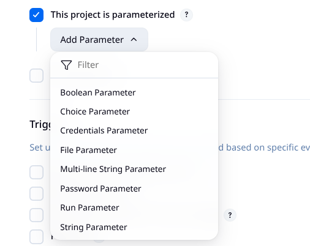

- Completamos los campos de la siguiente manera:

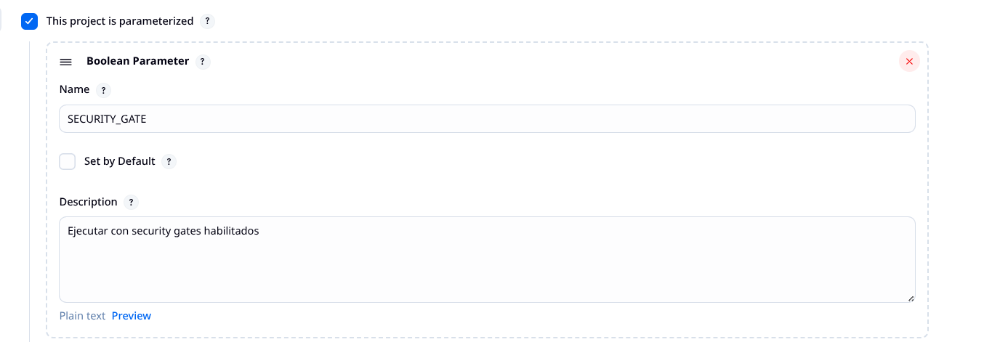

### 2.6.3. Apuntar a Jenkinsfile
En la sección  "Definition" seleccionamos la opción "Pipeline script from SCM", y allí completamos con 
- "Repository URL" con https://github.com/francoprieto/trabajo-final.git

- "Branch Specifier (blank for 'any')" completar con: */main

- "Script Path" completar con: ./ejercicio-2/Jenkinsfile

## 2.7. Ejecutamos el pipeline

- Al ingresar al Pipeline "ejercicio2" hacemos click en "Build with Parameters"

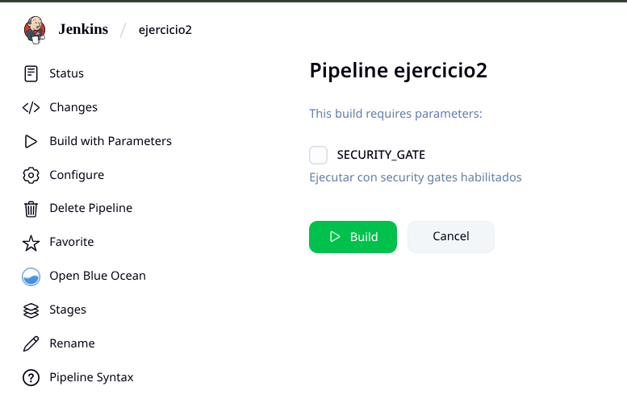

> Si marcamos SECURITY_GATE se ejecutarán los security gates con Bandit y Dependency-Track. Si dejamos desmarcado esto se omitirá.

### 2.7.1. Ejemplo de resultado de ejecución sin Security Gates

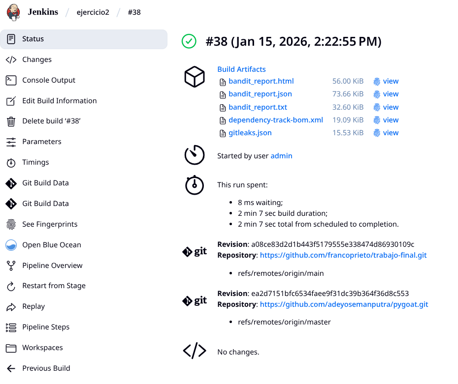

### 2.7.2. Ejemplo de resultado de ejecución con Security Gates

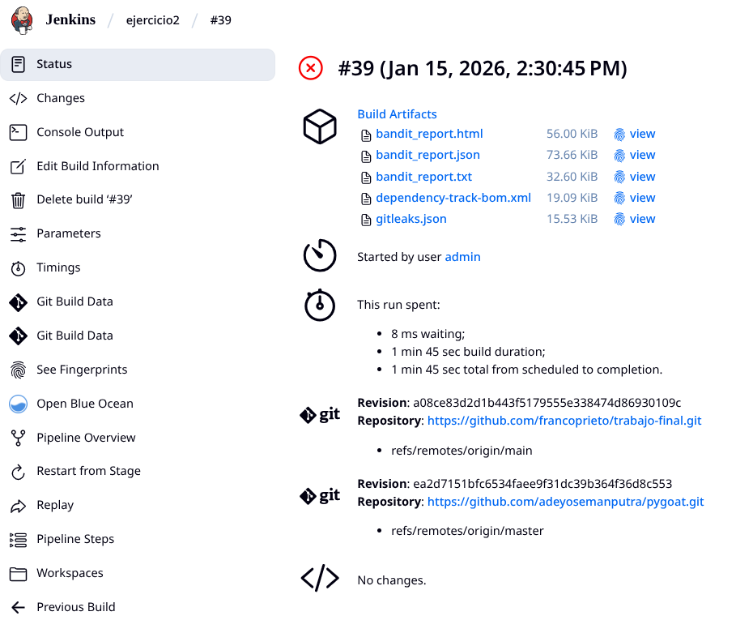

Verificamos el "Console Output" y vemos que el Security Gate de Bandit provocó que el pipeline falle:

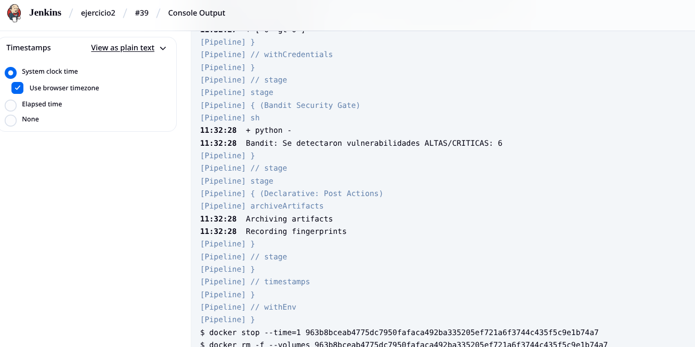

## 2.8. Integración con Dependency-Track

- Ingresamos a Dependency-Track: http://localhost:8082 y vamos al menú "Projects", encontramos a "Pygoat"

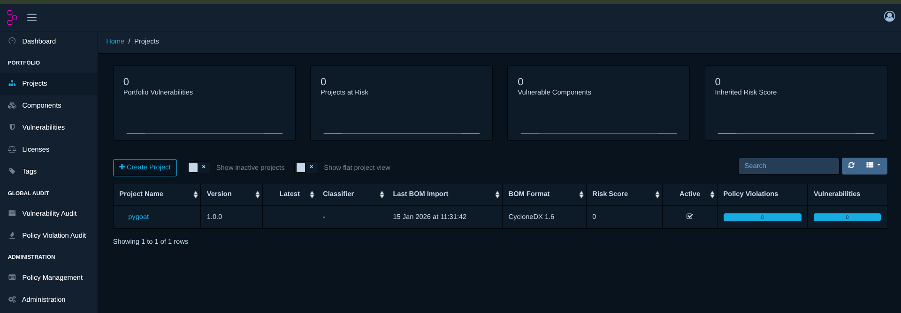

- Entramos a pygoat y luego vamos a la pantalla "Components" visualizamos las dependencias del projecto:

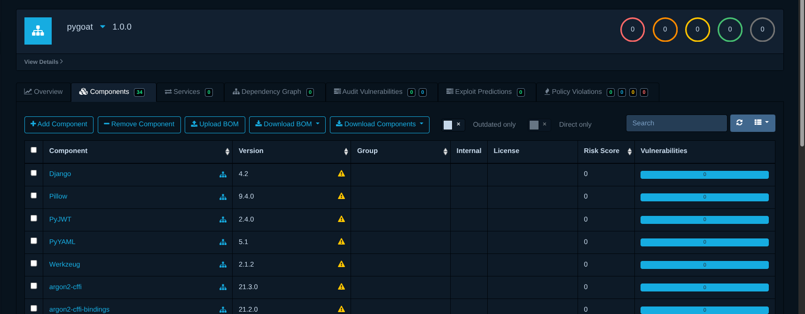

## 2.9. Integración con DefectDojo

- Ingresamos a DefectDojo: http://localhost:8083 y encontramos que existe "*1 Active Engagement*" y varios Hallazgos (findings):

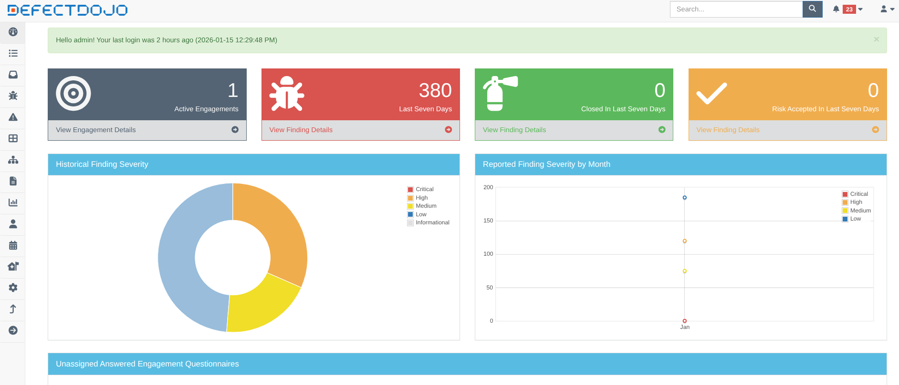

- Hacemos click en "View Engagement Details" y nos muestra la información del *engagement*:

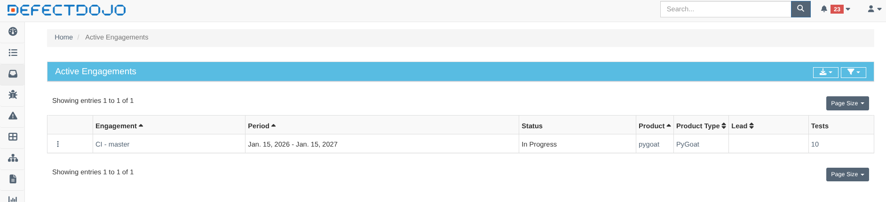

- Hacemos nuevamente click sobre el nombre del *Engagement* que en este caso es "CI - master" y vemos la información de los análisis de las herramientas utlizadas:

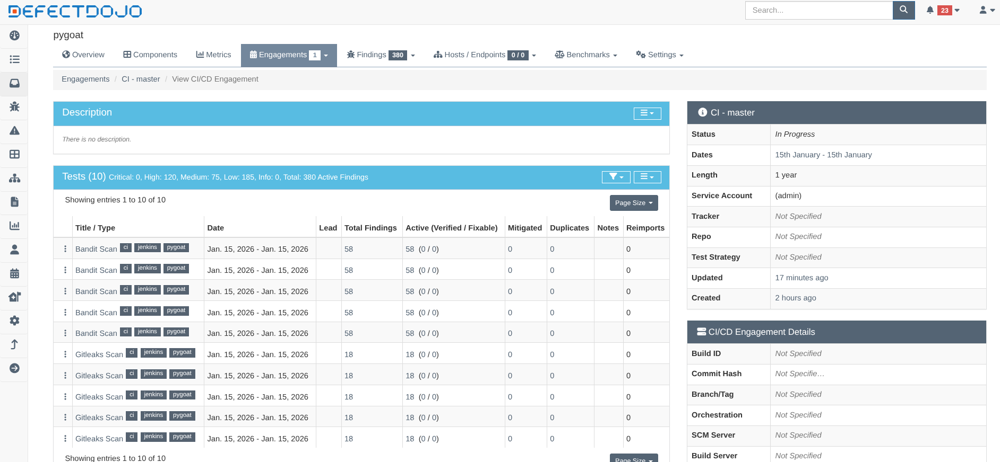

- Vamos a la pestaña "Findigs" y seleccionamos "View Active Findings" veremos la lista de hallazgos:

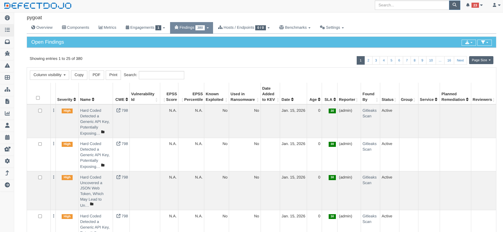
