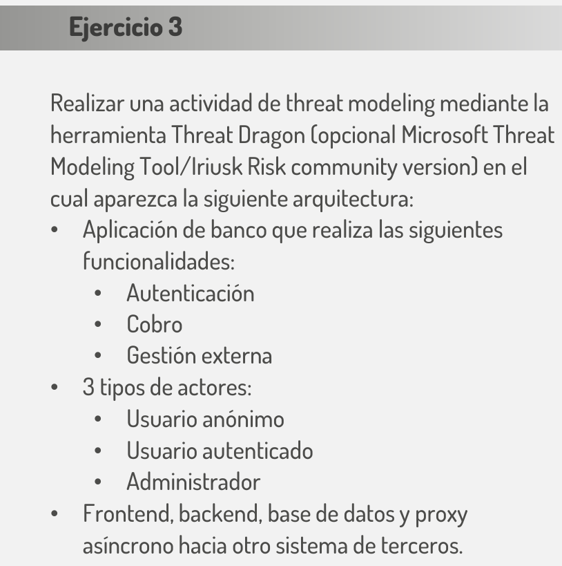
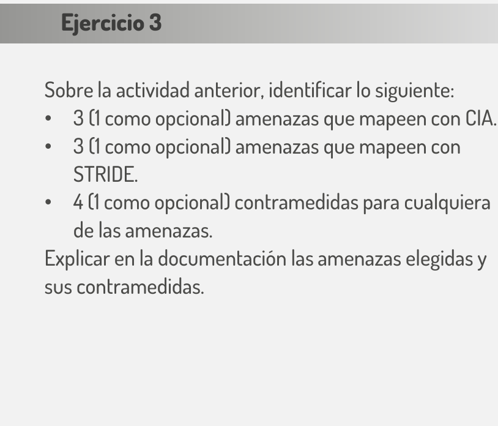
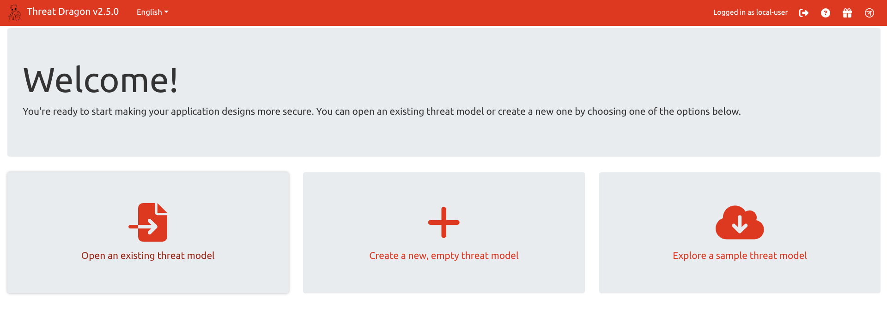
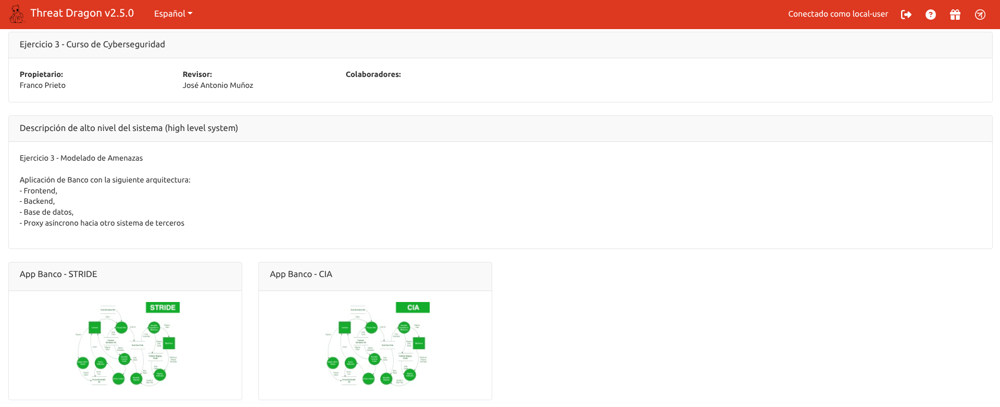
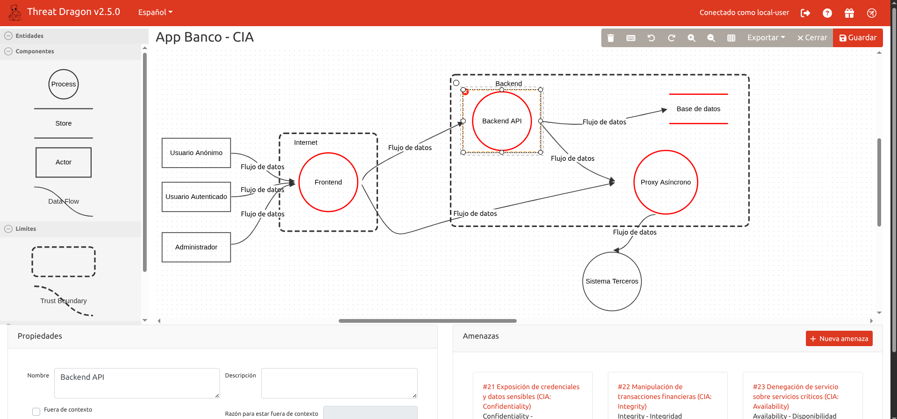
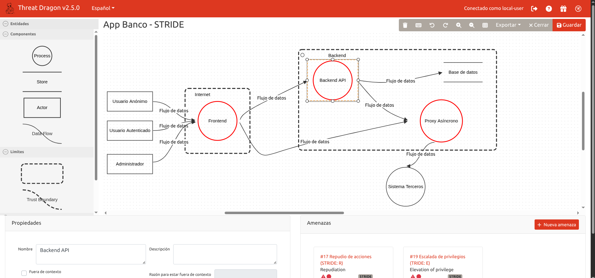

# 3. Ejercicio 3




## 3.1. Iniciamos el contenedor de Threat Dragon

Ejecutamos los siguientes comandos desde el directorio ejercicio-3:

```bash
chmod +x *-threatdragon.sh # Solo necesario si da error de permisos 

./iniciar-threatdragon.sh
```

## 3.2. Abrimos el modelo

Ingresar al Threat Dragon http://localhost:3000/ , hacemos click en "Login to local session" y seleccionamos la opción "Open an existing threat model"



Seleccionamos y abrimos el archivo *Ejercicio3.json*



## 3.2.1. Diagrama de amenazas CIA

Hacemos click en "App Banco - CIA" y se abre el siguiente diagrama:



> Al hacer click sobre un componente (Ejemplo Backend), podemos visualizar las amenazas relacionadas abajo

## 3.2.2. Diagrama de amenazas STRIDE

Hacemos click en "App Banco - STRIDE" y se abre el siguiente diagrama:



> Al hacer click sobre un componente (Ejemplo Backend), podemos visualizar las amenazas relacionadas abajo

## 3.2.3. Informe completo

Hacemos click en la opción "Reporte", permite exportar a PDF un reporte con un resumen y el detalle de las amenazas, incluyendo el tipo, descripción y acciones para mitigar (contramedidas):


> Vea el archivo "Reporte-threat-dragon.pdf" para visualizar el resultado.