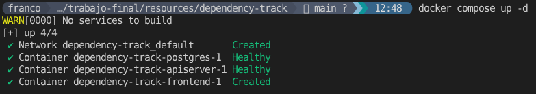

# Pasos para montar el entorno Dependency-Track

1. Ejecutar el docker compose estando en el directorio dependency-track

```bash
docker compose up -d
```



2. Ingresar al Dependency-Track con las credenciales: 
Usuario: admin
Password: admin

http://localhost:8082


3. Seguir los pasos para cambiar el password por defecto de admin
