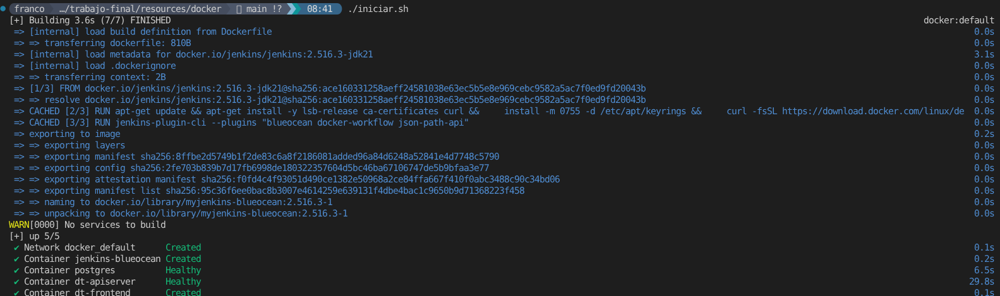

# Montar contenedores docker

- Requisitos: tener configurado el [entorno](../../README.md)

## Iniciar los contenedores

Dentro del directorio *resources/docker* ejecutar los siguientes comandos:
```bash
chmod +x iniciar.sh # <-Necesario si da error de permiso de ejecución
./iniciar.sh
```

El resultado esperado sería parecido a lo siguiente:



## Detener los contenedores
Dentro del directorio *resources/docker* ejecutar los siguientes
comandos:
```bash
chmod +x detener.sh # <-Necesario si da error de permiso de ejecución
./detener.sh
```